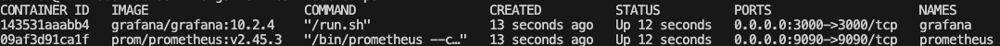
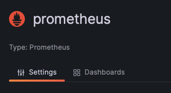

# Go Metrics

Collecting server metrics is essential for maintaining the health, performance, and security of IT infrastructure, as well as for optimizing resource usage and ensuring compliance with industry standards and regulations.
### promethues

Prometheus is the best tool for collecting metrics in Golang. Check [here](https://pkg.go.dev/github.com/prometheus/client_golang/prometheus).

### Grafana

Grafana is a powerful tool for monitoring and observability, offering flexibility, scalability, and ease of use for organizations of all sizes. It is widely used across industries for monitoring infrastructure, applications, IoT devices, and [more](https://grafana.com).

## Getting Start
In our Go project, we just need to import the dependent library.

```go get github.com/prometheus/client_golang```

Attach suitable metrics to relevant functions to evaluate the performance of the scope. Check example code [here](./main.go).

## Step One

Start the server to collect the metrics.

```go run main.go```

and check the metrics by using follow URL,

```http:\\localhost:8181\metrics```

you can find the metrics begin as **go_metrics_***

## Step Two

Server metrics need to be collected and visualized to analyze the data. Prometheus and Grafana need to be started and configured along with Docker.

### Docker Setup

Install Docker with Docker Compose. Check out [here](https://docs.docker.com/engine/install/)

Prometheus and Grafana Docker configuration can be found in docker-compose.yml. First of all, we need to create the network mode,

```bash 
docker network create metrics
```

Then initiate the Docker Compose by using the following command,

```bash
./metrics-run.sh
```




Now you can check the promethues dashboard by using follow link,

```http://localhost:9090/graph```

Server target is already set via the [promethues.yml](./prometheus/prometheus.yml)

#### Grafana

Let's check the grafana dashboard through,

```http://localhost:3000/```

Configure the grafana database configuration by adding database,




